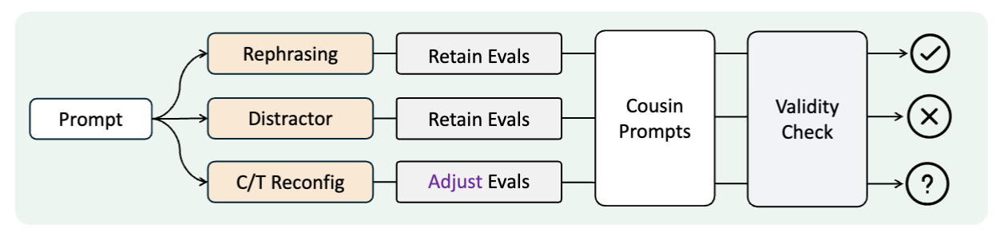

# 🧩 Revisiting the Reliability of Language Models in Instruction-Following




## 📘 Overview

This repository provides a reproducible pipeline for studying **the nuance-oriented reliability** of large language models in instruction-following.
It includes all stages — from **data augmentation** and **code-assisted validity checks** to **automatic evaluation** on IFEval and IFEval++ benchmarks.


## 📂 Directory Structure
```bash
Reliable-IF/
├── assets/                         # Original and augmented datasets
│   ├── ifeval_original.jsonl       # Original IFEval dataset
│   ├── ifeval_original_fix.jsonl   # Cleaned/processed data
│   └── ifeval_pp_verified.jsonl             # Augmented dataset
│
├── data_synthesis/                # Data augmentation & sanity check
│   ├── exp1_rephrase/             # Rephrase experiments
│   ├── exp2_add_distractor/       # Add distractors
│   ├── exp3_constraint-task_reconfiguration/ 
│   └── data_checker.py            # Validity check script
│
├── src/                            # Source code for IFEval
│   ├── evaluation_lib.py          
│   ├── instructions_registry.py           
│   ├── instructions_util.py
│   └── instructions.py
│
├── evaluation_main.py              # Main evaluation script
├── generate_response.py            # Script to generate model responses
├── run_if.sh                       # Pipeline runner
├── requirements.txt                # Requirements
└── README.md
```


## ⚙️ Environment Setup

```bash
conda create -n ifeval_pp python=3.10
conda activate ifeval_pp
pip install -r requirements.txt
```

## 📚 Dataset Reference

The extended dataset **IFEval++** is derived from the original [IFEval benchmark](https://huggingface.co/datasets/google/IFEval) by Google DeepMind.  
IFEval++ is constructed through systematic cleaning, augmentation, and validation for scalable instruction-following evaluation.

**Original Data**
- `ifeval_original.jsonl` – the original IFEval dataset (see Reference above).
- `ifeval_original_fix.jsonl` - manually cleaned version.


Augmented dataset is generated via the scripts in `data_synthesis/`, including:
- **Rephrasing**: `exp1_rephrase/`
- **Adding distractors**: `exp2_add_distractor/`
- **Constraint/task reconfiguration**: `exp3_constraint-task_reconfiguration/`

After augmentation, run the validity check with:

```bash
python data_synthesis/data_checker.py \
    --input_file /assets/ifeval_original_fix.jsonl \
    --target_dir /path/to/checker_annotation
```


## 🧪 Evaluation / Testing

Model response generation and evaluation can be executed in one step:

```bash
bash run_if.sh
```

**Configuration:**

- `input_data` – path to the input dataset

- `output_dir` – directory to store responses and evaluation results

- `model_name` – model identifier (e.g. gpt-5)

Results are saved under:
```bash
<output_dir>/
├── responses/     # Model outputs
└── evaluation/    # Evaluation metrics
```


## 📜 Citation

If you feel that IFEval++ is useful in your research, please cite our paper and the original IFEval preprint:

```bibtex
@article{dong2025revisiting,
  title={Revisiting the Reliability of Language Models in Instruction-Following}, 
  author={Jianshuo Dong and Yutong Zhang and Yan Liu and Zhenyu Zhong and Tao Wei and Chao Zhang and Han Qiu},
  year={2025},
  journal={arXiv preprint arXiv:2512.14754},
}
```


```bibtex
@article{zhou2023instruction,
  title={Instruction-Following Evaluation for Large Language Models},
  author={Zhou, Jeffrey and Lu, Tianjian and Mishra, Swaroop and Brahma, Siddhartha and Basu, Sujoy and Luan, Yi and Zhou, Denny and Hou, Le},
  journal={arXiv preprint arXiv:2311.07911},
  year={2023}
}
```